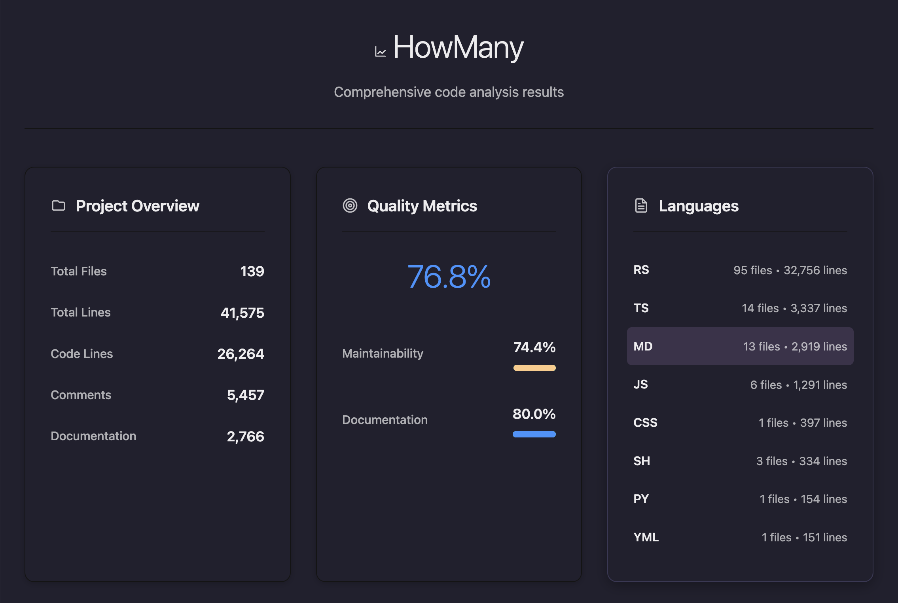
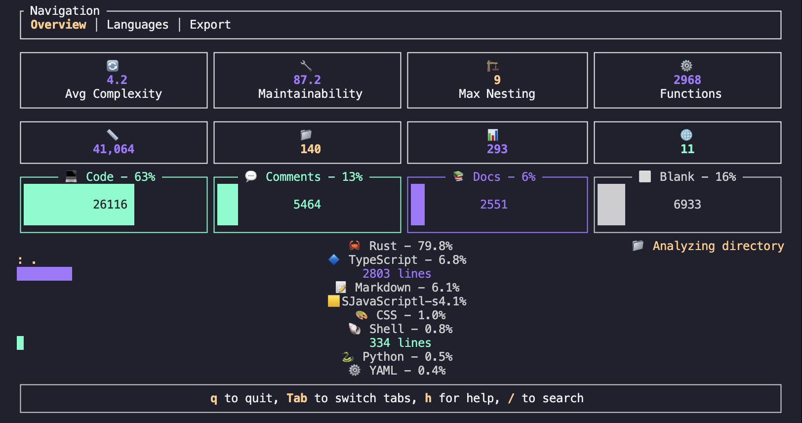

# HowMany VS Code Extension

**Intelligent code analysis with complexity metrics and quality scores**

A VS Code extension that integrates with the [HowMany](https://github.com/GriffinCanCode/howmany) code analysis tool to provide real-time insights into your codebase.

## Screenshots

## What It Does

- **Live Line Counts**: Every file carries its own breakdown above the first line — `412 TypeScript · 305 code · 47 doc · 60 blank` — recounted as you type, from the unsaved buffer
- **Threshold Warnings**: Files that run long, or that document too little of themselves, are reported in the problems panel
- **Status Bar Integration**: Shows live metrics (lines of code, file count, or quality score) in your VS Code status bar
- **Interactive Reports**: Generate detailed analysis reports with quality metrics, complexity scores, and language breakdowns
- **Quality Assessment**: Evaluate code maintainability, documentation coverage, and technical debt

- **Multi-Language Support**: Analyze 25+ programming languages with intelligent file detection




## Why Use It

- **Immediate Feedback**: See code metrics without leaving your editor
- **Quality Awareness**: Track code health and identify areas needing attention  
- **Project Understanding**: Quickly assess unfamiliar codebases
- **Technical Debt**: Quantify maintainability issues before they become problems
- **Team Alignment**: Share consistent quality metrics across development teams



## Installation

Install the CLI and let it set the editor up:

```bash
# Using Homebrew (macOS/Linux)
brew install GriffinCanCode/howmany/howmany

# Using Cargo
cargo install howmany

howmany init
```

`howmany init` installs this extension and points it at the binary it just
installed. To do it by hand instead, get the extension from the [VS Code
Marketplace](https://marketplace.visualstudio.com/items?itemName=GriffinCanCode.howmany)
and install the CLI separately.

## Usage

- **Status Bar**: Click the HowMany indicator for quick actions
- **Command Palette**: Search "HowMany" for available commands
- **Context Menu**: Right-click folders or files for analysis options

## Configuration

Key settings in VS Code preferences:

```json
{
  "howmany.statusBar.display": "smart",
  "howmany.statusBar.format": "abbreviated",
  "howmany.autoAnalyze": true,
  "howmany.liveCounts": true,
  "howmany.binaryPath": "howmany"
}
```

The thresholds behind the problems-panel warnings live with the CLI's own
settings rather than here, so the same limits apply in every editor:

```toml
# howmany.toml
[lsp]
max_file_lines = 800
min_doc_ratio = 0.05
```

## Requirements

- VS Code 1.85.0 or higher
- HowMany CLI installed and accessible in PATH (3.1 or later for live counts;
  everything else works with any version)
- Node.js 22+ (for development only; the extension runs on VS Code's bundled Node)

## Integration

This extension interfaces directly with the [HowMany Rust binary](https://github.com/GriffinCanCode/howmany), providing:

- Type-safe communication between TypeScript and Rust
- Efficient JSON-based data exchange
- Automatic error handling and recovery
- Caching for improved performance

## Related Tools

- [HowMany Core](https://github.com/GriffinCanCode/howmany) - The main CLI tool
- [HowMany GitHub Action](https://github.com/GriffinCanCode/howmany-actions) - CI/CD integration

## License

MIT License - see [LICENSE](LICENSE) for details. 
